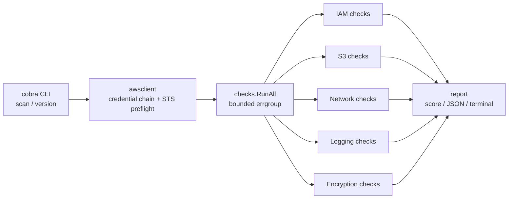

# CloudAudit

A Go CLI that audits an AWS account against a curated set of [CIS AWS Foundations
Benchmark](https://www.cisecurity.org/benchmark/amazon_web_services) checks and produces a
scored compliance report — JSON for machines, a color-coded summary for humans.

Every AWS API call is **read-only**: the tool never modifies resources.

## Usage

```console
$ cloudaudit scan
Auditing account 123456789012 as arn:aws:iam::123456789012:user/auditor (region us-east-1)

PASS   IAM-1  [CRITICAL] Root account has MFA enabled (CIS 1.5)
FAIL   IAM-2  [MEDIUM  ] No credentials unused for 45+ days (CIS 1.12)
         - ci-user: access key 1 unused for 45+ days
FAIL   S3-1   [CRITICAL] S3 public access is blocked (CIS 2.1.4)
         - website-assets: no public access block configured
PASS   NET-2  [HIGH    ] No security group allows 0.0.0.0/0 to port 3389 (CIS 5.3)
PASS   LOG-1  [CRITICAL] A multi-region CloudTrail is enabled and logging (CIS 3.1)
SKIP   ENC-2  [HIGH    ] RDS instances are encrypted at rest (CIS 2.3.1)
         - account has no RDS instances
...

14 checks: 9 passed, 4 failed, 0 errored, 1 skipped
Compliance score: 72.6%

$ cloudaudit scan --output json | jq .score
$ cloudaudit scan --out report.json          # terminal summary + JSON file
$ cloudaudit scan --region eu-west-1
```

Credentials come from the standard AWS credential chain: environment variables,
`~/.aws/credentials`, or an IAM role. The identity needs read-only access to IAM, S3, EC2,
CloudTrail, and RDS (the AWS-managed `SecurityAudit` policy more than covers it).

Exit codes: `0` compliant, `2` findings, `1` operational error.

### Docker

```console
$ docker build -t cloudaudit .
$ docker run --rm -e AWS_REGION=us-east-1 \
    -v ~/.aws:/home/nonroot/.aws:ro cloudaudit scan
```

## Checks

| ID | CIS | Check | Severity |
|---|---|---|---|
| IAM-1 | 1.5 | Root account has MFA enabled | Critical |
| IAM-2 | 1.12 | No credentials unused for 45+ days | Medium |
| IAM-3 | 1.16 | No customer-managed policies allow full `*:*` administration | High |
| IAM-4 | 1.8/1.9 | Password policy requires length ≥ 14 and reuse prevention ≥ 24 | Medium |
| S3-1 | 2.1.4 | S3 public access is blocked (account-wide or per bucket) | Critical |
| S3-2 | 2.1.1 | All S3 buckets have default encryption | High |
| S3-3 | — | S3 buckets have server access logging enabled | Low |
| NET-1 | 5.2 | No security group allows 0.0.0.0/0 to port 22 | High |
| NET-2 | 5.3 | No security group allows 0.0.0.0/0 to port 3389 | High |
| NET-3 | 5.4 | Default security groups restrict all traffic | Medium |
| LOG-1 | 3.1 | A multi-region CloudTrail is enabled and logging | Critical |
| LOG-2 | 3.2 | CloudTrail log file validation is enabled | Medium |
| ENC-1 | 2.2.1 | EBS encryption by default is on and all volumes are encrypted | High |
| ENC-2 | 2.3.1 | RDS instances are encrypted at rest | High |

**Scoring** is severity-weighted (Critical 10, High 6, Medium 3, Low 1):
`score = passed weight / (passed + failed weight)`. Checks that error (e.g. missing
permission) or don't apply (e.g. no RDS instances) are reported but excluded from the score.

## Architecture



Each check declares a narrow interface over exactly the SDK calls it makes; the real AWS
SDK v2 clients satisfy these implicitly and tests substitute small fakes — no mock framework.
Checks run concurrently through a bounded `errgroup` since every call is an independent read.

## Development

```console
$ go build ./...
$ go test ./...
$ golangci-lint run
```

Built with Go, AWS SDK for Go v2, and cobra. Ships as a distroless Docker image built in a
multi-stage `Dockerfile`. CI (GitHub Actions) runs build, tests, lint, a Docker build, and —
when AWS secrets are configured — a live scan of a test account.
